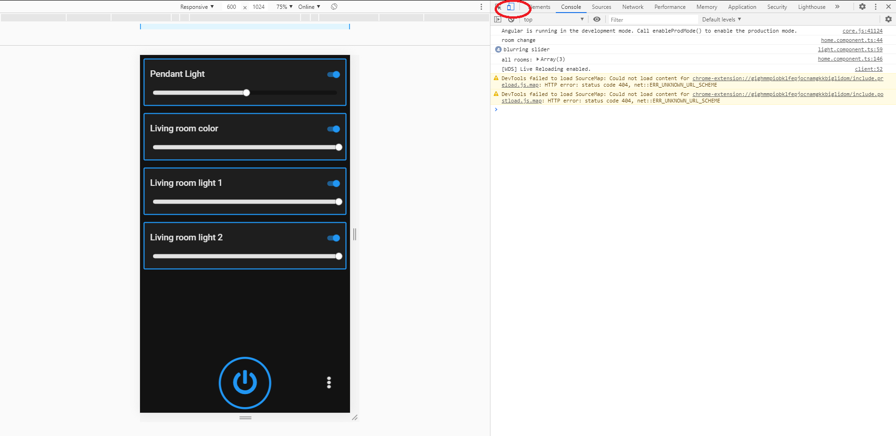

## Todo
- Create a settings feature to set/reset configuration
- Create a quick control feature for all lights (e.g. double tap power button to turn on/off all lights)


# LightSwitchUI

This Light Switch UI is designed to work in an internal network to control a Philips Hue Bridge. It leverages the API Service that is stored within the Bridge which makes DIY projects easier to develop. The UI design of this project is designed for a touchscreen viewed in portrait style. More Specifically, it was designed on a 7 inch screen with the resolution of 1024 x 600 (rotated 90 degrees). The UI is built using Angular, uses NRWL file architecture, and made native using Electron.

The UI Color Design follows most of the general principles listed out by [material.io](https://material.io/design/color/dark-theme.html#behavior)

If you'd like to build out your own color pallete for theming, you can edit the color variables `$primary`, `$accent`, `$foreground`, `$background` in
> apps/light-switch-ui/src/styles.scss

## Development Prerequisite (for Windows)

1.  Install [Nodejs and NPM](https://nodejs.org/en/download/releases/) (known to be successful to Node 12.16.3 and 6.14.4)
2.  Install the angular cli version 9.1.4 globally by running `npm install -g @angular/cli@9.1.4` in a terminal
2.  Install the electron-packager globally  by running `npm install -g electron-packager`
2.  Install node-gyp version 6.1.0 globally by running `npm install -g node-gyp@6.1.0`
2.  Know how to use Chrome Dev tools (open Chrome and press `ctrl + shift + J` to open dev tools for the current tab)
3.  A file compressor like 7zip to compress the compiled native project into a tarball (.tar file)
4.  Download Putty to SSH into the Raspberry Pi
5.  An SFTP program (like Filezilla) to transfer the compiled applicaton onto the Raspberry Pi
6.  VSCode is highly recommended for text editing. Super useful when you install the following extensions:
    - Angular Language Service
    - Prettier - Code Formatter
    - Nx Console
    - TSLint
    - XML
7. You can use VSCode to open the root directory of the project.
8. Recommended to Install Git Bash. Set the default terminal shell for VSCode to use Git Bash (instead of Windows Command Prompt)
    - This isn't a necessary step. I just think Git Bash is more useful than Command Prompt.

## Prepare Raspberry Pi

1. Install the Raspbery Pi OS/Raspbian (works with Buster)
2. Enable SSH on the Raspberry Pi
3. Have autologin onto desktop on startup
4. Rotate the touchscreen into portrait mode
5. [Set the touch matrix respective to the screen orientation (basically just means rotate the touch orientation to match screen orientation). The desktop GUI for Buster comes bundled with Xserver, so we'll set the touch orientation for Xserver](https://wiki.ubuntu.com/X/InputCoordinateTransformation)
    - Test the command first. To run the xinput commands, you can't use SSH from your Windows machine otherwise the command won't work. You will have to run the command natively from a terminal within the Raspberry Pi Desktop
    - Running the command is only temporary and will have to be set again when the Raspberry Pi reboots. One way to work around this is to set an autostart script.
        1. create a file in the directory: `/home/pi/.config/autostart` (you might have to create the autostart folder) with the file tag .desktop (ex: `touch-calibration.desktop`)
        2. within the file, use this template to write out the file contents (only filling in the <> without the <>):
        ```
          [Desktop Entry]
          Type=Application
          Name=<script name>
          Exec=<command to be executed on boot>
        ```

        3. Here's an example:
        ```
          [Desktop Entry]
          Type=Application
          Name=touch-calibration
          Exec=xinput set-prop 'wch.cn USB2IIC_CTP_CONTROL' 'Coordinate Transformation Matrix' 0 -1 1 1 0 0 0 0 1
        ```

        4. This will only run when the Raspbian Desktop GUI is loaded.

## Installing the project for development, testing, and building
1. Navigate to the root directory of the project. If you have VSCode opened at the project's root directory, you can open a terminal sessions by pressing `Ctrl + J`
2. Run `npm install`. This can take about 5-10 minutes before it is completed
3. Once install is complete, run `ng serve`
4. Use Chrome to navigate to http://localhost:4200
5. You might notice the on the browser, the cursor is gone. That is because we set the cursor to none in the file `apps/light-switch-ui/src/styles.scss`
    - For Development you have two options:
        1. You can comment out the line contains `cursor: none`
        2. Use Chrome Dev Tools to toggle device toolbar
        

## Running the application
- To run the application in a browser, run `ng serve` while in the project root directory
- To run a sample of the application in a native state, run `npm run electron`

## Building the application for use
- To build the application for your current system, run `npm run electron-build`
    - this will build the application for you current system. You'll find that the contents are outputted in a folder such `light-switch-ui-win32-x64`
    - Go ahead and run the .exe file to see the compliled application run.
- To build the application for the RPi's architecture, run `npm run electron-build-pi`
    - You'll find that the executable for this version of the build is named: `light-switch-ui`
    - **Be sure that when the build completes and the contents have been transferred to the pi, that the file `light-switch-ui` has all permissions (chmod 777)**

## Application Behavior
The application was designed with the idea that the users would have a touch panel per room. So the main screen of the UI will always be set to control whichever room was specified for the app

You can use the touch panel to control a different room associated with the Hue Bridge, but after 15 seconds, the UI will switch back to what the main room was set to.

### First time setup
Because the UI was designed on a per room basis, it made more sense to create a First time setup 'Wizard' that stores the configuration rather than editing a configuration file per panel. The setup will automatically search for a bridge, ask you to authenticate the app with the bridge, then ask what room the touch panel will be stored in. **Once the first time setup is ran and you are on the home screen, be sure to soft reboot the RPi via a terminal running `sudo reboot` so that the configs persist correctly.** This only has to be done if the configs change at all

### Where the data is stored
The configurations are persisted via the HTML Localstorage API. This helps for when the RPi has to reboot, it doesn't lose track of the configuration.

### Main Screen Behavior
The main screen will always display the lights in the room that had been selected as the main room in the first time setup. When you navigate to another room in the application, the UI will switch back to the main room after 15 seconds of inactivity.

### Accomodating The Hue Bridge Limits
The Hue Bridge Developer documentation states that you should limit the commands being sent to the bridge. They recommend that there should be no more than 10 commands sent per second for a light and no more than 1 command per second for a group/room. To accomodate for these guidelines, while changing the brightness of a bulb, the UI will only check for the updated value once every quarter second and update the brightness. Additionally, the UI only updates the light states every 15 seconds.

## Tranferring Contents to your Raspberry Pi
Use a software like Filezilla to perform an SFTP session to your RPi. Be sure that after you build the application, you compress the built files only into a single tarball. Then transfer that tarball to the Raspberry Pi. This ensures that all contents of the application are transferred correctly and also increases the speed of the transfer. Linux has a native command to extract tarballs. Use that to extract the contents. You can then navigate to the extracted content and execute the GUI by running `./light-switch-ui` 
> Be sure to grant all permissions to the application's executable (light-switch-ui). ex: chmod 777 light-switch-ui
That will enable the application to open on startup.


